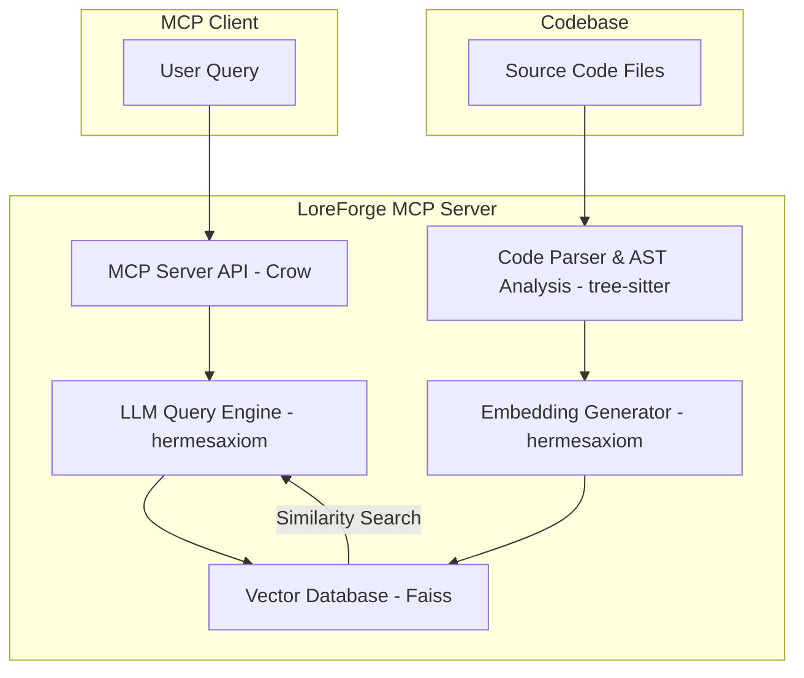

# Project Plan: "LoreForge" MCP Server

## 1. Project Goal

To create an MCP server that provides deep insights into codebases. The server will parse code to understand its structure, generate embeddings for semantic search, and use an LLM to answer complex questions about functionality and call graphs.

## 2. Core Components & Technology Stack

The system will be built using a C++ technology stack.

| Component | Description | Proposed Technology |
| :--- | :--- | :--- |
| **MCP Server API** | Exposes the server's capabilities to MCP clients. | Crow (C++ micro web framework) |
| **Package Manager** | Manages project dependencies. | vcpkg |
| **Code Parser** | Traverses source code files, identifies key structures (functions, classes), and extracts their content and metadata. | tree-sitter (C++ API) |
| **Chunking & AST Analysis** | Breaks down code into meaningful semantic chunks (e.g., functions, methods) for embedding. Analyzes the Abstract Syntax Tree (AST) to build call graphs. | Custom C++ logic using tree-sitter's output. |
| **Embedding Generator** | Converts code chunks into numerical vector representations (embeddings). | hermesaxiom (with the option to use ONNX Runtime as a backend later). |
| **Vector Database**| Stores the embeddings and allows for efficient similarity searches. | Faiss (C++) |
| **LLM Query Engine**| Uses a Large Language Model to interpret user queries, synthesize information from retrieved code chunks, and generate natural language descriptions. | https://github.com/caseymcc/hermesaxiom (Git Submodule) |
| **Model Selection** | The LLM to power the query engine. | Recommendation: Start with Qwen2.5-Coder-7B-Instruct or DeepSeek-Coder-V2-Lite-Instruct. These models are compatible with GGUF format used by many C++ inference engines. |

## 3. System Architecture

Here is a diagram illustrating how the components will interact:

## 4. Development Roadmap

A phased approach to development using a C++ toolchain:

### Phase 1: Core Parsing & Setup
- [x] Setup docker build environment with required build dependencies, cmake, clang, ninja, vcpkg, etc...
- [x] Initialize a C++ project using CMake and set up vcpkg for dependency management.
- [x] Set up a basic server with a health check endpoint using Crow.
- [x] Integrate the tree-sitter library (C++ API) and build parsers for an initial target language (e.g., C++ or Python).
- [ ] Create a C++ application that can take a file path, parse it, and print out a list of all function/class names.
  - [ ] Provide basic tests for a small c++ and python repo

### Phase 2: Embeddings & Vector Storage
- [ ] Integrate the Faiss library into the project using vcpkg.
- [ ] Use the hermesaxiom library to handle the loading of an embedding model.
- [ ] Modify the parsing application from Phase 1 to chunk code and generate embeddings for each function/class using hermesaxiom.
- [ ] Store these embeddings in a Faiss index, associating them with their source code and file path.

### Phase 3: LLM Integration & Querying
- [ ] Add hermesaxiom to the project as a Git submodule.
- [ ] Integrate the submodule into the CMake build process.
- [ ] Create a query function that:
    - [ ] Takes a natural language query.
    - [ ] Generates an embedding for the query using hermesaxiom.
    - [ ] Retrieves the top N most similar code chunks from Faiss.
    - [ ] Formats a prompt containing the query and the retrieved code.
    - [ ] Sends the prompt to the LLM via the hermesaxiom library and returns the result.

### Phase 4: MCP Server Implementation
- [ ] Define the MCP tool specifications (e.g., `analyze_repository`, `query_codebase`).
- [ ] Implement the Crow endpoints that correspond to these tools.
- [ ] Connect the endpoints to the backend logic developed in Phases 1-3.