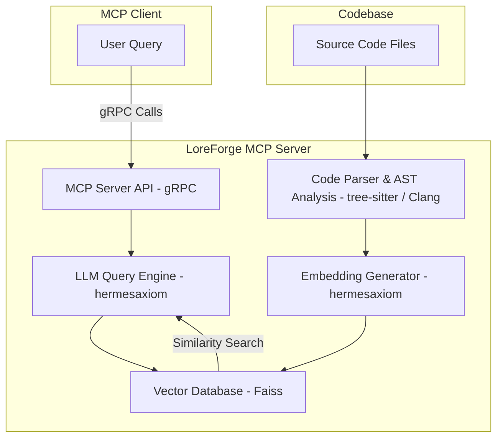

# Project Plan: "LoreForge" Model Context Protocol (MCP) Server

## 1\. Project Goal

To create an MCP server that provides deep, context-specific insights into C++ codebases for AI agents. The server will parse C++ code to understand its intricate structure, extract rich code intelligence (e.g., function signatures, call graphs), generate embeddings for semantic search, and utilize an LLM to answer complex questions about functionality and call graphs.

## 2\. Core Components & Technology Stack

The system will be built using a C++ technology stack, leveraging the chosen tools.

| Component | Description | Proposed Technology | Considerations/Insights from Research |
| :--- | :--- | :--- | :--- |
| **MCP Server API** | Exposes the server's capabilities to MCP clients. | **gRPC** (C++) | gRPC offers significant advantages for machine-to-machine communication: high performance (HTTP/2, Protocol Buffers), strong typing, code generation for clients/servers, and support for streaming. This will require defining service contracts in `.proto` files. |
| **Package Manager** | Manages project dependencies. | vcpkg | Standard C++ package manager. gRPC and Protocol Buffers can be managed via vcpkg. |
| **Code Parser & AST Generator** | Traverses source code files, identifies key structures (functions, classes), and extracts their content and metadata. | **tree-sitter** (C++ API) | Tree-sitter provides a robust AST. The challenge will be to extract semantic information robustly using tree-sitter's output, potentially in conjunction with language-specific tools in Phase 5. |
| **Chunking & AST Analysis** | Breaks down code into meaningful semantic chunks (e.g., functions, methods) for embedding. Analyzes the Abstract Syntax Tree (AST) to build call graphs. | Custom C++ logic using **tree-sitter's output** (and later, deeper semantic tools). | This component is critical to bridge any semantic analysis gaps. Techniques to derive call graph information and precise function signatures from `tree-sitter`'s AST (and later, compiler-grade ASTs) will be developed here. |
| **Embedding Generator** | Converts code chunks into numerical vector representations (embeddings). | **hermesaxiom** | **hermesaxiom** is in development and included here for development to continue on it. **This is a critical dependency.** |
| **Vector Database** | Stores the embeddings and allows for efficient similarity searches. | **Faiss** (C++) | Faiss is a high-performance C++ library for similarity search and clustering of dense vectors. It is a fundamental building block. Custom development for data persistence, comprehensive indexing strategies, and distributed deployment will be necessary. |
| **LLM Query Engine** | Uses a Large Language Model to interpret user queries, synthesize information from retrieved code chunks, and generate natural language descriptions. | **hermesaxiom** (Git Submodule) | **hermesaxiom** remains a core component for LLM interaction. **This is a critical dependency.** |
| **Model Selection** | The LLM to power the query engine. | Recommendation: Start with Qwen2.5-Coder-7B-Instruct or DeepSeek-Coder-V2-Lite-Instruct. These models are compatible with GGUF format used by many C++ inference engines. | Good starting point for code-focused LLMs. |

## 3\. System Architecture

Here is a diagram illustrating how the components will interact, reflecting the transition to gRPC.

## 4\. Development Roadmap

A phased approach to development using a C++ toolchain, incorporating insights on how to best utilize the chosen tools.

**Build Environment:** The entire build environment for `LoreForge` is managed within a Docker container.

  * The Docker image definition is located in the `Dockerfile`.
  * A helper script, `runDocker.sh`, is provided to manage the Docker container lifecycle (build, start, stop, restart, attach).
  * Before running `runDocker.sh`, you should check if the docker `loreforge-dev-container` is already running.
  * All build-related commands (e.g., CMake configuration, compilation) should be executed *inside* the running Docker container.
  * All execution, debugging, and testing of the application should be executed *inside* the running Docker container.
  * The `build.sh` script automates CMake configuration and Ninja compilation steps, and **should also be run inside the Docker container.**
  * `runDocker.sh`/`build.sh` should be called in separete calls as they can not run together.
  * **To start/manage the Docker build environment, execute `runDocker.sh [options]` from the project root.** Common commands include:
      * `runDocker.sh`: Starts the container if it exists, or creates it if not, and then attaches.
      * `runDocker.sh {cmds}`: Starts the container if it exists, or creates it if not, and then `docker exec` the {cmds}.
      * `runDocker.sh --stop`: Stops and removes the container.
      * `runDocker.sh --restart`: Restarts an existing container and attaches.
      * `runDocker.sh --rebuild`: Builds the Docker image and starts/restarts the container.
  * **Rebuilds of the Docker image (`docker build`) should only occur when changes are made to the `Dockerfile` or its direct dependencies.** Otherwise, simply starting or restarting the container is sufficient.
  * **To build execute `build.sh [options]` from inside the running docker in the project root.** Common commands include:
      * `build.sh`: will build the application
      * `build.sh --rebuild`: cleans the build and then builds the application
      * `build.sh --rebuild-cmake`: clean cmake build directory and re-runs cmake and build
  

-----

### Phase 1: Core Parsing & gRPC Setup

This phase focuses on establishing the fundamental C++ parsing capabilities and setting up the gRPC communication infrastructure.

  - [x] Setup Docker build environment with required build dependencies (CMake, Clang, Ninja, vcpkg, etc.).
  - [x] Initialize a C++ project using CMake and set up vcpkg for dependency management.
  - [x] **Integrate gRPC library using vcpkg**: Ensure gRPC and Protocol Buffers are correctly configured as project dependencies.
  - [x] **Define initial gRPC service in `.proto` file**: Start with basic RPCs like `HealthCheck` and `ParseFile`.
  - [x] **Implement a basic gRPC server**: Set up a server that can listen for incoming requests and respond to the `HealthCheck` RPC.
  - [ ] Integrate the **tree-sitter** library (C++ API) and build parsers for an initial target language (e.g., C++ or Python).
  - [ ] Create a C++ application (or extend the gRPC server's internal logic) that can take a file path, parse it using tree-sitter, and print out a list of all function/class names.
  - [ ] Provide basic tests for a small C++ and Python repo to validate parsing and basic structure extraction.
  - [ ] Implement a basic gRPC client to interact with the `HealthCheck` and `ParseFile` RPCs.

-----

### Phase 2: LLM Integration & Querying

This phase focuses on enabling natural language querying of the codebase by integrating the LLM with the retrieval system.

  - [ ] Add **hermesaxiom** to the project as a Git submodule (git@github.com:caseymcc/hermesaxiom.git) and integrate the submodule into the CMake build process. **Focus - hermesaxiom is a submodule and in development, make changes to its repo as needed according to its `docs/development_plan.md` to support `LoreForge`'s needs.**
      - [ ] **Dependency on hermesaxiom Phase 1 (Core Library Enhancement):** `hermesaxiom` needs its core structure solidified, `ModelManager` refined, and initial providers (like OpenAI) implemented. Unit testing and basic documentation are also crucial here for `LoreForge` to reliably use it.
      - [ ] **Dependency on hermesaxiom Phase 2 (API and Feature Expansion):**
          - [ ] `hermesaxiom::embedding()` function for generating vector embeddings from text needs to be implemented. This is **critical** for `LoreForge`'s `Embedding Generator`.
          - [ ] Full streaming support in `hermesaxiom`'s `streamingCompletion` function across all providers will be beneficial for `LoreForge` to provide real-time responses for longer LLM interactions.
          - [ ] `CompletionRequest` needs to include a comprehensive set of parameters (e.g., `top_p`, `stop sequences`, `temperature`) so `LoreForge` can finely tune LLM behavior.
  - [ ] Define new gRPC RPCs in the `.proto` file for querying, e.g., `QueryCodebase(QueryRequest) returns (QueryResponse)`.
  - [ ] Create a query function within the gRPC server that:
      - [ ] Takes a natural language query (received via gRPC).
      - [ ] Generates an embedding for the query using **hermesaxiom**'s `embedding()` function.
      - [ ] Retrieves the top N most similar code chunks from Faiss.
      - [ ] Formats a prompt containing the query and the retrieved code.
      - [ ] Sends the prompt to the LLM via the **hermesaxiom** library and returns the result (via gRPC).
  - [ ] Provide a caching system to be maintained on the filesystem:
      - [ ] Write cache to filesystem (e.g., serialized parsed data, embeddings, Faiss index snapshots).
      - [ ] Implement asynchronous updates to watch files that have been processed for changes and update the cache and Faiss index as needed.

-----

### Phase 3: Embeddings & Vector Storage

This phase integrates the embedding generation process and sets up Faiss for efficient storage and retrieval.

  - [ ] Integrate the Faiss library into the project using vcpkg.
  - [ ] Use the **hermesaxiom** library to handle the loading of an embedding model.
      - [ ] **Dependency on hermesaxiom Phase 2 (Embeddings API):** This is a direct dependency on `hermesaxiom::embedding()`.
  - [ ] Modify the parsing application/server logic to:
      - [ ] Chunk code into meaningful semantic units (e.g., function bodies, class definitions) based on tree-sitter's AST output.
      - [ ] Generate embeddings for each function/class using **hermesaxiom**.
      - [ ] Store these embeddings in a Faiss index, associating them with their source code, file path, and any extracted metadata (function names, potentially derived call relationships if possible with tree-sitter).
      - [ ] **Key Consideration for Faiss**: Implement custom logic for data persistence (saving/loading the Faiss index to disk) and consider strategies for managing large indices that might exceed RAM. Faiss primarily focuses on similarity search, so database-like features will need to be custom-built around it.

-----

### Phase 4: gRPC Server Implementation & Advanced Capabilities

This phase completes the gRPC-based MCP server implementation and introduces advanced query capabilities.

  - [ ] Refine the `.proto` definitions for comprehensive MCP tool specifications (e.g., `AnalyzeRepository`, `FindSimilarCode`, `GetCallGraphInfo`, `GetFunctionSignature`). Consider using gRPC streaming RPCs where appropriate (e.g., for sending large analysis results or continuous updates).
  - [ ] Implement the gRPC service methods that correspond to these tools within the server.
  - [ ] Connect these gRPC methods to the backend logic developed in Phases 1-3.
  - [ ] Implement specific query capabilities based on the data extracted by tree-sitter (and later, richer semantic analysis):
      - [ ] **Semantic Similarity Search**: Using Faiss for identifying code blocks with similar meaning.
      - [ ] **Structural Similarity Analysis**: If possible with tree-sitter's AST, implement basic structural comparisons or pattern matching for code snippets.
      - [ ] **Call Graph Information**: Provide functionalities to query and present call relationships that could be derived from tree-sitter's AST.
      - [ ] **Basic Function Signature Queries**: Allow filtering based on function names or a subset of signature information that is reliably extracted by tree-sitter.
  - [ ] Conduct comprehensive testing of the end-to-end RAG system with various C++ codebases and query types via a gRPC client.

-----

### Phase 5: Deep Semantic Analysis & Multi-Language Support

This phase addresses the limitations of `tree-sitter` for full semantic analysis and introduces robust, language-specific parsing for richer code intelligence.

  - [ ] **C/C++ Semantic Analysis Integration**:
      - [ ] **Research & Integration of Clang/LibTooling**: Investigate and integrate Clang/LibTooling for comprehensive C/C++ semantic analysis. This includes:
          - [ ] Setting up `compile_commands.json` generation for projects to feed into Clang Tooling.
          - [ ] Using `ASTContext` and `RecursiveASTVisitor` to extract full function signatures (including return types, parameter types, template arguments), class hierarchies, and precise call graph information.
          - [ ] Leveraging Clang's static analysis capabilities to identify potential issues or deeper code insights.
      - [ ] **Hybrid Parsing Strategy for C/C++**: Develop a strategy to combine `tree-sitter`'s fast structural parsing with `Clang/LibTooling`'s deep semantic analysis. `tree-sitter` can provide quick overviews and initial chunking, while `Clang` fills in the semantic gaps for C++.
      - [ ] Update the C++ AST analysis component to leverage Clang's output for enriched data.
  - [ ] **Python Semantic Analysis**:
      - [ ] **Integrate `libclang` (for Python C++ extensions) or explore `libcst`/`ast` module analysis (if pure Python is also a target)**: For Python, while not a C++ tool, if the server needs to analyze Python code, consider how to extract semantic information. Options include:
          - [ ] **`libclang` bindings for Python C++ extensions**: If the target Python code includes C/C++ extensions, `libclang` can be used via Python bindings.
          - [ ] **Python's `ast` module**: For pure Python code, the built-in `ast` module can be used to parse Python code into an AST and extract semantic details like function arguments, variable definitions, and class structures. Libraries like `libcst` offer a concrete syntax tree, preserving more original code details.
      - [ ] Develop a separate, language-specific analyzer module for Python that feeds into the common embedding and querying pipeline.
  - [ ] **Generalized Semantic Enrichment Framework**:
      - [ ] Design a pluggable architecture for semantic analysis, allowing new language-specific parsers/analyzers to be easily integrated. This would involve defining a common interface for semantic information extraction (e.g., `FunctionInfo`, `CallGraphNode`, `TypeDefinition`).
      - [ ] Implement a dispatcher that routes code analysis requests to the appropriate language-specific semantic analyzer based on file extension or other language identification heuristics.
  - [ ] **Enhance Call Graph Generation**:
      - [ ] Refine the call graph generation logic to utilize the comprehensive semantic information provided by Clang (for C/C++) and other language-specific tools. This includes resolving indirect calls, function pointers, and virtual method calls.
      - [ ] Store and index call graph data in a way that allows for efficient querying (e.g., "show all callers of X", "show all functions called by Y", "find paths between A and B").
  - [ ] **Refine Function Signature Extraction**:
      - [ ] Ensure that extracted function signatures for C/C++ are complete and accurate, including namespaces, return types, const/volatile qualifiers, and full parameter types (including template specializations).
      - [ ] Extend this to other supported languages as their semantic analysis capabilities are integrated.
  - [ ] **Comprehensive Testing with Semantic Data**:
      - [ ] Expand the test suite to validate the accuracy of extracted function signatures, call graphs, and other semantic information across different languages and code complexities.
      - [ ] Test the RAG system's ability to answer more complex semantic queries that rely on this richer data (e.g., "Explain the purpose of this template function and how it's used throughout the codebase," "Show me all implementations of this interface," "Trace the data flow for this variable").

